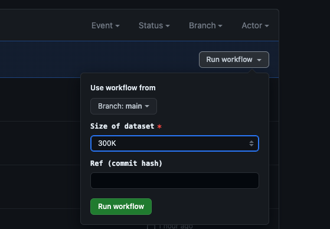

# mti-lab-sisap23-challenge-submission

This repository is a submission for the [SISAP 2023 Indexing Challenge](https://sisap-challenges.github.io/) by team mti-lab.

## Information
- Task: A
- Subset: clip768 (300K, 10M, 30M, 100M)
- members
  - Yutaro Oguri (The University of Tokyo, oguri [at] hal.t.u-tokyo.ac.jp)
  - Yusuke Matsui (The University of Tokyo, matsui [at] hal.t.u-tokyo.ac.jp)

## How to run on CI
The following instructions are for the CI workflow. 

- Go to [CI page in Actions tab](https://github.com/mti-lab/mti-lab-sisap23-challenge-submission/actions/workflows/ci.yml).
- Click `Run workflow` button.
- Select `main` branch. (by default)
- Choose size of the subset you will evaluate. (300K, 10M, 30M, 100M)
- Fill in `ref` input with the commit hash you will evaluate.
  - The commit hash you should use in evaluation is on [our pre-registration issue](https://github.com/sisap-challenges/challenge2023/issues/2).





The following jobs are executed in sequence.
- `Run benchmark (size=300K)`
- `Run benchmark (size=10M)`
- `Run benchmark (size=30M)`
- `Run benchmark (size=100M)`

The each result including csv files and figures is saved as an artifact `Results on ${size}`. You can download it from the GitHub Actions page.


## How to run on local environment
The following instructions are the same as the CI workflow.

### Install dependencies
```bash
conda create -n faiss python=3.10
conda activate faiss
conda install -c pytorch faiss-cpu=1.7.4 mkl=2021 blas=1.0=mkl
conda install matplotlib scikit-learn
pip install h5py
```

### Run search
Please replace size `300K` with `10M`, `30M`, and `100M` for other subsets.

```bash
chmod +x ./run_300K.sh
./run_300K.sh
```

### Run evaluation
```bash
python eval/eval.py
python eval/plot.py --size 300K res.csv
```

## Description of our solution
Details will be described in the paper. Here is a short summary.

- Python and [Faiss](https://github.com/facebookresearch/faiss) library are used for the implementation.
- [NSG](https://github.com/ZJULearning/nsg) is used for the base index structure. Its implementation is included in Faiss.
- Search better enterpoints of NSG graph traversal by using kmeans clustering.
- Reduce vector dimension by using PCA. The dimension is a SIMD-friendly value.
- Use [AntihubRemoval](https://github.com/naaktslaktauge/antihub-removal) for the preprocessing, which reduce the number of data points by removing anti-hub points.
- Hyperparameters are tuned with multi-objective blackbox optimization using [Optuna](https://optuna.readthedocs.io/en/stable/index.html) library.

## Scripts
### Scripts for search
- search/search.py
  - Main script for search
- search/antihub_removal.py
  - [AntihubRemoval](https://github.com/naaktslaktauge/antihub-removal) implementation.
- search/ep_searcher.py
  - Algorithms to search for better enterpoints of NSG graph traversal by using kmeans clustering.

### Scripts for tuning parameters
These scripts are used for tuning hyperparameters, which is not used for evaluation.

- search/analyze_singleobj_opt.py
- search/analyze_multiobj_opt.py
- search/opt_singleobj_nsg.py
- search/opt_multiobj_nsg.py

### Scripts for evaluation
- eval/ directory contains scripts for evaluation from [sisap23-laion-challenge-evaluation](https://github.com/sisap-challenges/sisap23-laion-challenge-evaluation/tree/master).

## Reference
- AntihubRemoval: K. Tanaka, Y. Matsui, and S. Satoh (2021). Efficient Nearest Neighbor Search by Removing Anti-hub. ICMR 2021
- NSG: C. Fu, C. Xiang, C. Wang, and D. Cai (2019). Fast Approximate Nearest Neighbor Search With The Navigating Spreading-out Graphs. VDLB 2019
- Faiss: Johnson, J., Douze, M., & Jegou, H. (2019). Billion-scale similarity search with GPUs. IEEE Transactions on Big Data, 7(3), 535–547.
- Optuna: Akiba, T., Sano, S., Yanase, T., Ohta, T., & Koyama, M. (2019). Optuna: A Next-generation Hyperparameter Optimization Framework. In Proceedings of the 25th ACM SIGKDD International Conference on Knowledge Discovery and Data Mining.
